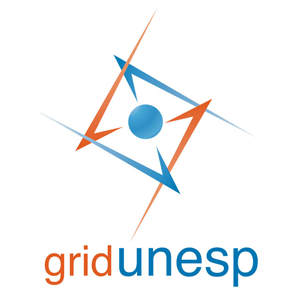

# Workflow para Dinâmica Molecular utilizando gridUNESP




> Tutorial para criar contêiner com suporte ao uso de GPU CUDA no gridUNESP.

⚠️ Antes de começar, leia a documentação do [gridUNESP](https://www.ncc.unesp.br/gridunesp/docs/v2/index.html) e documentações complementares [CUDA 13](https://docs.nvidia.com/cuda/index.html) e [GROMACS 2026.x](https://manual.gromacs.org/current/index.html).

---
## 🔧 Criando o container com Apptainer

A tecnica de contêineres com apptainer, docker e outros softwares busca criar imagens e ambientes de sistemas com bibliotecas instaladas o qual o processamento é feito dentro do contêiner que se comunica com o host principal. Recentemente, o gridUNESP implementou a contêinirização em seus servidores.

Para criar um contêiner, precisamos de dois arquivos: [gromacs-gpu.def](gridunesp/gromacs-gpu.def) e [build.sh](gridunesp/build.sh).

**[gromacs-gpu.def](gridunesp/gromacs-gpu.def):**
```
Bootstrap: docker
From: nvidia/cuda:12.9.1-devel-ubuntu24.04

%post
    # --- 1. Preparação do Sistema ---
    export DEBIAN_FRONTEND=noninteractive
    export CUDA_HOME=/usr/local/cuda
    export PATH=$CUDA_HOME/bin:$PATH
    export LD_LIBRARY_PATH=$CUDA_HOME/lib64:$LD_LIBRARY_PATH
    
    apt update
    apt-mark hold $(apt-cache pkgnames | grep -E "^cuda|^libnvidia|^libcudnn") 2>/dev/null || true
    apt upgrade -y
    
    nvcc --version
    cat /etc/os-release
    uname -r
    g++ --version
    ldd --version
    
    apt install -y \
        build-essential \
        libboost-all-dev \
        cmake \
        unzip \
        bzip2 \
        file \
        gcc \
        g++ \
        gfortran \
        perl \
        gawk \
        curl \
        git \
        hwloc \
        libhwloc-dev \
        libopenblas-dev \
        liblapack-dev \
        libfftw3-dev \
        wget \
        ca-certificates
    
    apt autoremove -y
    apt autoclean -y
    
    ln -fs /usr/share/zoneinfo/America/Sao_Paulo /etc/localtime
    dpkg-reconfigure -f noninteractive tzdata

    # --- 2. Compilação do GROMACS ---
    GROMACS_VERSION=2026.2
    
    cd /opt
    wget https://download.pytorch.org/libtorch/cu128/libtorch-shared-with-deps-2.10.0%2Bcu128.zip
    unzip libtorch-shared-with-deps-2.10.0+cu128.zip
    rm libtorch-shared-with-deps-2.10.0+cu128.zip
    mv libtorch /usr/local/libtorch

    wget https://ftp.gromacs.org/gromacs/gromacs-${GROMACS_VERSION}.tar.gz
    tar xfz gromacs-${GROMACS_VERSION}.tar.gz
    cd gromacs-${GROMACS_VERSION}
    
    mkdir build
    cd build
    
    cmake .. \
        -DCMAKE_BUILD_TYPE=Release \
        -DGMX_BUILD_OWN_FFTW=ON \
        -DREGRESSIONTEST_DOWNLOAD=ON \
        -DGMX_SIMD=AVX_512 \
        -DGMX_GPU=CUDA \
        -DCUDAToolkit_ROOT=/usr/local/cuda \
        -DCUDA_TOOLKIT_ROOT_DIR=/usr/local/cuda \
        -DGMX_HWLOC=ON \
        -DGMX_USE_PLUMED=ON \
        -DGMX_USE_COLVARS=INTERNAL \
        -DGMX_NNPOT=TORCH \
        -DCMAKE_PREFIX_PATH="/usr/local/libtorch;/usr/local/cuda" \
        -DCMAKE_INSTALL_PREFIX=/usr/local/gromacs

    make -j$(nproc)
    make install -j$(nproc)
    
%environment
    # --- Variáveis do GROMACS (Definições) ---
    export GMXBIN=/usr/local/gromacs/bin
    export GMXLDLIB=/usr/local/gromacs/lib
    export GMXMAN=/usr/local/gromacs/share/man
    export GMXDATA=/usr/local/gromacs/share/gromacs
    export PATH=$GMXBIN:$PATH
    export LD_LIBRARY_PATH=$GMXLDLIB:/usr/local/cuda/lib64:$LD_LIBRARY_PATH
    export MANPATH=$GMXMAN:$MANPATH

%runscript
    echo "Conteiner GROMACS Classic iniciado..."
    echo "Autor: Patrick Allan dos Santos Faustino, PhD"
    exec "$@"

%labels
    Author "Patrick Allan dos Santos Faustino"
    Version "2026.06.19"
    Stack "Ubuntu 24.04 | CUDA 12 (sm_89) | GROMACS 2026.2 with NNPOT"
```

>[!WARNING]
> Mantenha sempre uma versão <= CUDA do contêiner em relação ao CUDA instalado no gridUNESP.
>

No arquivo [build.sh](gridunesp/build.sh), será enviado a tarefa de criar o contêiner para processamento do gridUNESP.

**[build.sh](gridunesp/build.sh):**
```
#!/bin/bash
#SBATCH -t 23:30:00
#SBATCH --job-name=apptainer
#SBATCH --cpus-per-task=32

export INPUT="gromacs-gpu.def"
export OUTPUT="*"
export VERBOSE="1"

job-nanny apptainer build gromacs-gpu.sif gromacs-gpu.def

```
```
sbatch build.sh
```

>[!TIP]
> Faça o download e backup do arquivo `gromacs-gpu.sif`. Esse arquivo é o contêiner criado e pode ser utilizado em qualquer computador compatível.
>

---
## 💎 Dinâmicas moleculares no contêiner

Para a dinâmica, utilize os arquivos de exemplo [md1.sh](gridunesp/md1.sh) e [run1.sh](gridunesp/run1.sh).

**[md1.sh](gridunesp/md1.sh):**
```
!/bin/bash

    # Verifica a versão do Gromacs
    gmx --version
    
    # Diretório de trabalho
    cd rep1
    
    # Gerar arquivo .tpr
    gmx grompp -v -f inputs/md.mdp -c npt.gro -t npt.cpt -o md_500ns.tpr -p topol.top
    
    # Dinâmica de produção
    gmx mdrun -v -deffnm md_500ns -ntmpi 1 -ntomp 24 -gpu_id 0 -nb gpu -pme gpu -bonded gpu -update gpu -pin on -maxh 23.3 

```

**[run1.sh](gridunesp/run1.sh):**
```
#!/bin/bash
#SBATCH -t 23:50:00
#SBATCH --partition=gpu
#SBATCH --nodes=1
#SBATCH --gres=gpu:1
#SBATCH --mem=16G
#SBATCH --job-name=job_rep1
#SBATCH --cpus-per-task=24
#SBATCH --mail-user=patrick.faustino@unesp.br
#SBATCH --mail-type=BEGIN,END,FAIL

export INPUT="rep1 gromacs-gpu.sif md1.sh"
export OUTPUT="*"
export VERBOSE="1"

module load gcc/14.3.0
module load cuda/12.9

# Executa o script de verificação dentro do container
job-nanny apptainer exec --nv ubuntu2404.sif bash md1.sh

```

```
sbatch run1.sh
```

---
## 🧰 Dicas para gridUNESP

```
ssh usuario@access.grid.unesp.br    # para acesso

squeue -u usuario    # lista tarefas do usuario
squeue -a            # lista todas as tarefas do grid

sbatch job.sh                 # submete a tarefa
scancel 00000000              # cancela a tarefa, onde 00000000 é o numero atribuido a tarefa
scontrol show job 00000000    # verifica detalhes da tarefa

sshare -a | grep usuario       # verifica o FairShare, quanto maior for, maior a prioridade.

squeue -o "%.18i %.9Q %.8j %.8u %.10V %.6D %R" --sort=-p,i --states=PD    # verifica a fila das próximas tarefas

tail -f slurm-00000000.out    # acompanha o processamento da tarefa

sinfo -p gpu -o "%.10P %.5a %.10l %.6D %.6t %.8C %.8m %.25G"        # obter informações dos nós com GPU
sinfo -t idle        # nós que estão disponíveis.

```

---

### 🧪⚗️ *Boas simulações moleculares!* 🦠🧬

---
## 📜 Citação

- FAUSTINO, Patrick Allan dos Santos. *Readme: Tutorials*. 2026. DOI 10.5281/zenodo.16062830. Disponível em: [https://github.com/patrickallanfaustino/tutorials-workstation/blob/main/gridunesp-ptbr.md](https://github.com/patrickallanfaustino/tutorials-workstation/blob/main/gridunesp-ptbr.md). Acesso em: 18 jul. 2025.
