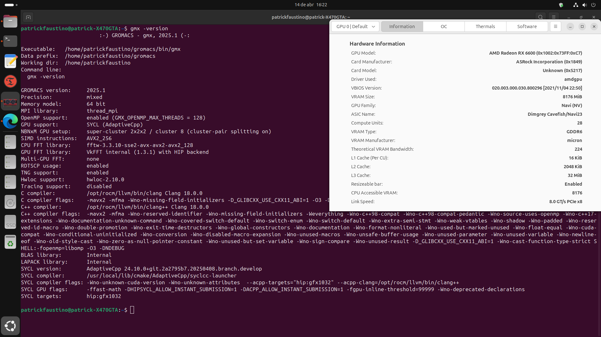

# Workflow de Instalação Gromacs 2025.x com ROCm 6.x e AdaptiveCpp 25.x no Ubuntu 24.04 Noble Numbat




> Tutorial para compilar o GROMACS 2025.4 com suporte NNPOT-PyTorch (Redes Neurais), usando AdaptiveCpp 25.10 em backend e ROCm 6.4 no Ubuntu 24.04.3 Kernel 6.14, para utilizar aceleração GPU AMD em desktop.

## 💻 Computador testado e pré-requisitos:
- CPU Ryzen 9 5900XT, Memória 2x16 GB DDR4, Chipset X570, GPU ASRock RX 6600 CLD 8 GB, dual boot com Windows 11 e Ubuntu 24.04 instalados em SSD's separados.

Antes de começar, verifique se você atendeu aos seguintes requisitos:

- Você tem uma máquina linux `Ubuntu 24.04.x` com instalação limpa e atualizado.
- Você tem uma GPU série `AMD RDNA2`. Testado com arquiteturas `RDNA3`.
- Documentações [ROCm 6.4](https://rocm.docs.amd.com/projects/install-on-linux/en/docs-6.4.3/index.html), [AdaptiveCpp 25.xx](https://github.com/AdaptiveCpp/AdaptiveCpp) e [GROMACS 2025.x](https://manual.gromacs.org/current/index.html).

Você vai precisar atualizar e instalar pacotes em sua máquina:
```
sudo apt update && sudo apt upgrade
sudo apt autoremove && sudo apt autoclean
sudo apt install build-essential
```

Para adicionar ferramentas necessárias ou atualizar com versões mais recentes:
```
sudo add-apt-repository ppa:ubuntu-toolchain-r/test
sudo apt update && sudo apt upgrade
```

Verifique também a versão do kernel (⚠️ versão = 6.8 Ok! 6.14 Ok!):
```
uname -r
```
Verifique seu diretorio padrão `$HOME`, pois será o caminho utilizado para a maioria das instalações e configurações. Explore!

>[!TIP]
> Inicialmente foi instalado no Kernel 6.8.12. Posteriormente o Kernel foi atualizado para 6.14 de acordo com as instruções em [https://ubuntu.com/kernel/lifecycle](https://ubuntu.com/kernel/lifecycle).
>

---
## 🔧 Instalando Timeshif

O [Timeshift](https://www.edivaldobrito.com.br/como-instalar-o-timeshift-no-ubuntu-linux-e-derivados/) é um software para criar backups. Recomendamos que seja criados backups para cada etapa completa. Para instalar o `Timeshift`, siga estas etapas:
```
sudo add-apt-repository ppa:teejee2008/timeshift
sudo apt update
sudo apt install timeshift
```

>[!TIP]
>
>Se desejar, instale o [GRUB CUSTOMIZER](https://www.edivaldobrito.com.br/grub-customizer-no-ubuntu/) para gerenciar o inicializador e [MAINLINE](https://www.edivaldobrito.com.br/como-instalar-o-ubuntu-mainline-kernel-installer-no-ubuntu-e-derivados/) para gerenciar o kernel instalado.
>
>```
>sudo add-apt-repository ppa:danielrichter2007/grub-customizer
>sudo apt update
>sudo apt install grub-customizer
>```
>
>```
>sudo add-apt-repository ppa:cappelikan/ppa
>sudo apt update
>sudo apt install mainline
>```
>

---
## 🔎 Instalando ROCm 6.x

Recomenda-se realizar todas as instalações na pasta `Downloads`. Vamos instalar o [ROCm 6.4](https://rocm.docs.amd.com/projects/install-on-linux/en/docs-6.4.3/install/install-methods/amdgpu-installer/amdgpu-installer-ubuntu.html).
```
cd $HOME/Downloads
sudo apt install "linux-headers-$(uname -r)" "linux-modules-extra-$(uname -r)"
sudo apt install python3-setuptools python3-wheel
wget https://repo.radeon.com/amdgpu-install/6.4.3/ubuntu/noble/amdgpu-install_6.4.60403-1_all.deb
sudo apt install ./amdgpu-install_6.4.60403-1_all.deb
sudo apt update
sudo amdgpu-install --usecase=rocm,rocmdev,hip,hiplibsdk,openmpsdk,mllib,mlsdk
sudo usermod -a -G render,video $LOGNAME
```
```
echo ‘ADD_EXTRA_GROUPS=1’ | sudo tee -a /etc/adduser.conf
echo ‘EXTRA_GROUPS=video’ | sudo tee -a /etc/adduser.conf
echo ‘EXTRA_GROUPS=render’ | sudo tee -a /etc/adduser.conf
```
```
reboot
```

Para verificar a instalação, utilize:
```
groups
sudo clinfo
sudo rocminfo
sudo rocm-smi
/opt/rocm/bin/hipconfig --full
```

> [!IMPORTANT]  
>Quando printar `rocminfo`, verificar o nome da placa que será apresentado como `gfx1032` (para RX 6600).
> 

Pode ser necessário a instalação da biblioteca `rocm-llvm-dev`:
```
sudo apt install rocm-llvm-dev
```

A GPU deverá ser identificada nas informações. Caso não consiga, experimente `reboot` e verifique novamente. A instalação ficará em `/opt/rocm`.

>[!TIP]
>
>Utilize o comando abaixo para listar todos `cases` disponíveis no `amdgpu-install` para instalação:
>
>```
>sudo amdgpu-install --list-usecase
>```
>
>Para remover `amdgpu-install`, utilize:
>
>```
>sudo amdgpu-install --uninstall --rocmrelease=all
>sudo apt purge amdgpu-install && sudo apt autoremove && sudo apt autoclean
>```
>```
>sudo rm /etc/apt/sources.list.d/amdgpu.list
>sudo rm /etc/apt/sources.list.d/rocm.list
>sudo rm -rf /var/cache/apt/*
>sudo apt clean all
>sudo apt update
>sudo reboot
>```
>

---
## ⌚ Instalando LACT

O aplicativo [LACT](https://github.com/ilya-zlobintsev/LACT) é utilizado para controlar e realizar overclocking em GPU AMD, Intel e Nvidia em sistemas GNU/Linux.
```
cd $HOME/Downloads
wget https://github.com/ilya-zlobintsev/LACT/releases/download/v0.8.3/lact-0.8.3-0.amd64.ubuntu-2404.deb
sudo dpkg -i lact-0.8.3-0.amd64.ubuntu-2404.deb
sudo systemctl enable --now lactd
```
**AMD Overclocking:** ative a função no LACT e faça um `reboot`.

>[!WARNING]
>
>Faça o download do pacote [LACT](https://github.com/ilya-zlobintsev/LACT/releases/) de acordo com a distribuição do Linux.
>

>[!NOTE]
>
>Para remover versões anteriores, utilize `sudo dpkg -r lact`.
>

---
## 🎏 Instalando Hardware Sensors Indicator

O aplicativo [HSI](https://github.com/alexmurray/indicator-sensors) é utilizado para monitorar a temperatura de CPU, GPU, Motherboard, etc. Recomenda-se a instalação pela Central de Aplicativos [Snap](https://snapcraft.io/indicator-sensors) do Ubuntu e configurar para inicialização automatica com monitoramento da CPU (Tctl).
```
sudo snap install indicator-sensors
```

---

## 🔨 Instalando AdaptiveCpp 25.x

O [AdaptiveCpp 25.x](https://github.com/AdaptiveCpp/AdaptiveCpp) irá trabalhar em backend com `rocm`. Recomenda-se o uso da pasta `Downloads`. Para instalar:
```
sudo apt install -y libboost-all-dev git cmake cmake-curses-gui
```
```
cd $HOME/Downloads
git clone https://github.com/AdaptiveCpp/AdaptiveCpp
cd AdaptiveCpp
sudo mkdir build && cd build
```

Para compilar com CMake (versão >=3.28):
```
sudo cmake .. \
-DCMAKE_INSTALL_PREFIX=/usr/local \
-DCMAKE_C_COMPILER=/opt/rocm/llvm/bin/clang \
-DCMAKE_CXX_COMPILER=/opt/rocm/llvm/bin/clang++ \
-DLLVM_DIR=/opt/rocm/llvm/lib/cmake/llvm/ \
-DWITH_ROCM_BACKEND=ON \
-DWITH_SSCP_COMPILER=OFF \
-DWITH_OPENCL_BACKEND=OFF \
-DWITH_LEVEL_ZERO_BACKEND=OFF \
-DWITH_CUDA_BACKEND=OFF \
-DDEFAULT_TARGETS='hip:gfx1032'
```
```
sudo make install -j$(nproc)
```

Para verificar a instalação, `acpp-info` e `acpp --version` deverá apresentar as informações da GPU:
```
acpp-info
acpp --version
```

>[!NOTE]
>
>**Meu Caso**: Utilizando `j$(nproc)`, define a quantidade de CPUs utilizadas na compilação. Pode ser omitido `-j$(nproc)`.
>

>[!WARNING]
>
>Sempre fique atento aos caminhos dos diretórios, *i.e* `/path/to/user/...`, porque são os maiores causadores de erros durante as compilações.
>

---
## 💎 Instalação do GROMACS 2025.x

**LIBTORCH!** É possivel instalar a biblioteca [libtorch](https://pytorch.org/) para utilizar Redes Neurais. Verifique a versão mais recente. Utilize a pasta `Downloads`.
```
cd $HOME/Downloads
wget https://download.pytorch.org/libtorch/cpu/libtorch-shared-with-deps-2.9.1%2Bcpu.zip
unzip libtorch-shared-with-deps-2.9.1+cpu.zip
```

Podemos instalar algumas bibliotecas auxiliares para o GROMACS:
```
sudo apt install grace hwloc texlive libhdf5-dev hdf5-tools
```

Por fim, antes de instalar podemos verificar a versão de algumas bibliotecas instaladas:
```
cmake --version
g++ --version
ldd --version
```

A partir de agora, você poderá seguir a documentação oficial [guia de instalação](https://manual.gromacs.org/current/install-guide/index.html).
```
wget ftp://ftp.gromacs.org/gromacs/gromacs-2025.4.tar.gz
tar -xvf gromacs-2025.4.tar.gz
cd gromacs-2025.4
sudo mkdir build && cd build
```

Para compilar com Cmake (versão >=3.28):
```
sudo cmake .. \
-DGMX_BUILD_OWN_FFTW=ON \
-DREGRESSIONTEST_DOWNLOAD=ON \
-DCMAKE_C_COMPILER=/opt/rocm/llvm/bin/clang \
-DCMAKE_CXX_COMPILER=/opt/rocm/llvm/bin/clang++ \
-DGMX_GPU=SYCL \
-DGMX_SYCL=ACPP \
-DCMAKE_INSTALL_PREFIX=$HOME/gromacs-acpp-torch_cpu \
-DHIPSYCL_TARGETS='hip:gfx1032' \
-DGMX_HWLOC=ON \
-DIMD=ON \
-DGMX_USE_PLUMED=ON \
-DGMX_NNPOT=TORCH \
-DCMAKE_PREFIX_PATH="$HOME/Downloads/libtorch"
```

Note que criei uma pasta chamada `gromacs-acpp-torch_cpu` para os arquivos compilados e indiquei com `-DCMAKE_INSTALL_PREFIX`, pois isso facilita a atualização do GROMACS no futuro.

>[!NOTE]
>
>**Meu Caso**: Atenção ao `-DHIPSYCL_TARGETS='hip:gfxABC'`, substitua com seus valores para a GPU.
>

Agora é o momento de compilar, checar e instalar:
```
sudo make -j$(nproc)
sudo make check -j$(nproc)
sudo make install -j$(nproc)
```

Para carregar a biblioteca e invocar o GROMACS:
```
source $HOME/gromacs-acpp-torch_cpu/bin/GMXRC
gmx -version
```

>[!WARNING]
>
>Durante `sudo make check -j$(nproc)` ocorreram erros por TIMEOUT. Prossegui e testei uma dinâmica simples e não houve problema. Aparentemente, usuários do GROMACS 2024/2025 enfrentam esses problemas e com `-DGMX_TEST_TIMEOUT_FACTOR=2` pode dar mais tempo para o teste.
>

>[!TIP]
>
>Você poderá editar o arquivo `$HOME/.bashrc` e adicionar o código `source $HOME/gromacs-acpp-torch_cpu/bin/GMXRC`. Assim, toda vez que abrir o terminal carregara o GROMACS.
>

>[!NOTE]
>***Extra:*** para compilar com suporte nativo HIP/ROCm sem Torch:
>```
>sudo cmake .. \
>	-DCMAKE_INSTALL_PREFIX=$HOME/gromacs-hip \
>	-DCMAKE_C_COMPILER=/opt/rocm/bin/amdclang \
>	-DCMAKE_CXX_COMPILER=/opt/rocm/bin/amdclang++ \
>	-DCMAKE_HIP_COMPILER=/opt/rocm/bin/amdclang++ \
>	-DGMX_GPU=HIP \
>	-DGMX_HIP_TARGET_ARCH=gfx1032 \
>	-DCMAKE_PREFIX_PATH="/opt/rocm" \
>	-DGMX_BUILD_OWN_FFTW=ON \
>	-DREGRESSIONTEST_DOWNLOAD=ON \
>	-DGMX_HWLOC=ON \
> -DIMD=ON \
>	-DGMX_USE_PLUMED=ON \
>	-DGMX_GPU_FFT_LIBRARY=rocFFT
>```
>
>***Extra:*** para compilar com suporte nativo HIP/ROCm e Torch (CPU):
>```
>sudo cmake .. \
>	-DCMAKE_INSTALL_PREFIX=$HOME/gromacs-hip-torch_cpu \
>	-DCMAKE_C_COMPILER=/opt/rocm/bin/amdclang \
>	-DCMAKE_CXX_COMPILER=/opt/rocm/bin/amdclang++ \
>	-DCMAKE_HIP_COMPILER=/opt/rocm/bin/amdclang++ \
>	-DGMX_GPU=HIP \
>	-DGMX_HIP_TARGET_ARCH=gfx1032 \
>	-DCMAKE_PREFIX_PATH="/opt/rocm;$HOME/Downloads/libtorch" \
>	-DGMX_BUILD_OWN_FFTW=ON \
>	-DREGRESSIONTEST_DOWNLOAD=ON \
>	-DGMX_HWLOC=ON \
> -DIMD=ON \
>	-DGMX_USE_PLUMED=ON \
>	-DGMX_GPU_FFT_LIBRARY=rocFFT
>```
>

---
## 🐍 Instalando ANACONDA e PyTorch

O [Anaconda](https://www.anaconda.com) é um importante pacote de bibliotecas Python voltados para o uso científico.
```
cd $HOME/Downloads
wget https://repo.anaconda.com/archive/Anaconda3-2025.06-1-Linux-x86_64.sh
bash Anaconda3-2025.06-1-Linux-x86_64.sh
source ~/.bashrc
conda config --set auto_activate_base false
conda info
```

Com os comandos acima será carregado no prompt (`source ~/.bashrc`) o conda `base`. Para desativar o carregamento automatico, utilizar `conda config --set auto_activate_base false`.

>[!TIP]
>
>Faça o download do pacote [Anaconda](https://www.anaconda.com/download) mais recente.
>

>[!WARNING]
>
>Certifique de que a instalação será no diretório `$HOME/anaconda3` confirmando `yes` para todas as respostas. **NÃO UTILIZE `sudo`**.
>

Agora, vamos criar um ambiente virtual e instalar o [Pytorch](https://pytorch.org/get-started/locally/). No diretório `$HOME`, crie um ambiente `gromacs-nnpot`:
```
cd $HOME
sudo apt install python3-venv libjpeg-dev python3-dev python3-pip
python3 -m venv gromacs-nnpot
source gromacs-nnpot/bin/activate
pip3 install torch torchvision torchaudio --index-url https://download.pytorch.org/whl/rocm6.4
pip3 install torchani mace-torch
```

Para testar:
```
python3 -c 'import torch' 2> /dev/null && echo 'Success' || echo 'Failure' # retorna Success
python3 -c "import torch; print(torch.cuda.is_available())"                # retorna True
python3 -c "import torch; print(torch.cuda.get_device_properties(0))"      # retorna informações GPU
python3 -c "import torch; x = torch.rand(5, 3); print(x)"                  # retorna matriz
```

>[!TIP]
>
>Caso deseje desistalar utilize `pip3 uninstall <biblioteca>`, para atualizar `pip3 install --upgrade <biblioteca>` e para listar os pacotes instalados `pip3 list`.
>

---

## 💎 Instalação do OpenMM 8.x

O [OpenMM](https://openmm.org/) é outro software baseado em Python para simulação de dinâmica molecular. Para sua instalação, vamos criar um ambiente virtual e instalar via pip no diretório padrão `$HOME`.
```
cd $HOME
python3 -m venv openmm
source $HOME/openmm/bin/activate
pip3 install openmm[hip6]
```

Para sair do ambiente criado, basta utilizar `deactivate`. Para verificar a instalação, onde será realizado teste com a Referência, CPU, HIP e OpenCL:
```
python -m openmm.testInstallation
```

>[!NOTE]
>***Extra:*** para compilar no Conda com suporte Torch:
>```
>conda create --name openmm-conda
>conda activate openmm-conda
>conda install -c conda-forge openmm-hip openmmforcefields openmm-torch openmm-ml
>```
>

Para remover o ambiente conda criado `conda env remove --name openmm-conda` e para listar todas os ambientes utilize `conda env list`.

---
## 🧬 Instalando VMD e Pymol

O [VMD](https://www.ks.uiuc.edu/Development/Download/download.cgi?PackageName=VMD) permite visualizar moléculas e realizar análises. Para instalação:
```
cd $HOME
wget https://www.ks.uiuc.edu/Research/vmd/vmd-1.9.3/files/final/vmd-1.9.3.bin.LINUXAMD64-CUDA8-OptiX4-OSPRay111p1.opengl.tar.gz
tar xvzf vmd-1.9.3.bin.LINUXAMD64-CUDA8-OptiX4-OSPRay111p1.opengl.tar.gz
cd  vmd-1.9.3
./configure
cd src
sudo make install -j$(nproc)
vmd
```

O [Pymol](https://www.pymol.org/) é outro software muito utilizado para visualização de moléculas:
```
sudo snap install pymol-oss
```

--
## 🧮 Instalando o Julia

O [Julia](https://julialang.org/) é uma linguagem de programação voltada para cálculos científicos, similar ao Python. Para instalar:

```
cd $HOME
sudo apt install curl
curl -fsSL https://install.julialang.org | sh
```

Para atualizar, utilize no terminal `juliaup update`.

---
## 🧰 Instalando ambientes: OpenBabel, AmberTools/ACPYPE, CGenFF, LigParGen, Alchemlyb/PyMBAR e Packmol.

[OpenBabel](https://openbabel.org/docs/index.html) é um pacote usado para manipular dados de modelagem molecular, química, etc. Para instalar:

```
sudo apt install openbabel
obabel --version
```

Para uso:
```
obabel -ismi ethanol.smi -opdb -O ethanol.pdb --title ETHANOL --gen3d --minimize --sd --ff GAFF --log

ou

obabel -:'CCO' -ogro -O ethanol.gro --title ETHANOL --gen3d --minimize --sd --ff GAFF --log
```

>[!NOTE]
>***Extra:*** para mais informações sobre todas as funções disponiveis, consulte `obabel -Hall`.
>

[AmberTools](https://ambermd.org/AmberTools.php) é uma coleção de programas gratuitos e de código aberto usados ​​para configurar, executar e analisar simulações moleculares.. Para instalar:

```
cd $HOME
conda create --name acpype
conda activate acpype
conda install --channel conda-forge ambertools openbabel
```

Em conjunto com o AmberTools, o [ACPYPE](https://github.com/alanwilter/acpype) é um pacote em python para gerar topologias de moléculas. Para instalar e utilizar:

```
pip install acpype
./run_acpype.py -h

acpype -i ethanol.mol2               # exemplo de uso para uma molécula de etanol.
```

[CGenFF](https://cgenff.com/) é um servidor web para gerar topologias de moléculas para o campo de força CHARMM36. É possivel obter as topologias e coordenadas diretamente no formato para Gromacs ou obter o arquivo `.str` para posterior conversão em ambiente. É necessário obter a molécula de interesse no formato `.mol2`.

```
conda create --name cgenff python=3.7
conda activate cgenff
conda install networkx=2.3 numpy

python cgenff_charmm2gmx_py3_nx2.py ETH ethanol.mol2 ethanol.str charmm36-jul2022.ff     # o campo de força deverá estar no mesmo diretório de trabalho.
```

[LigPargen](https://github.com/Isra3l/ligpargen/tree/main) é uma biblioteca desenvolvida para gerar topologias de moléculas para o campo de força OPLS. Faça o download do software [BOSS](https://traken.chem.yale.edu/software.html), descompacte em um diretório de trabalho.

```
sudo apt install csh
export BOSSdir=PATH_TO_BOSS_DIRECTORY            # pode ser incluido no arquivo ~/.bashrc
```

Para criar o ambiente e instalar:

```
conda create --name py37 python=3.7
conda activate py37
conda install -c rdkit rdkit
conda install --channel conda-forge openbabel
```
```
cd $HOME
git clone https://github.com/Isra3l/ligpargen.git
pip install -e ligpargen
cd ligpargen
python -m unittest test_ligpargen/test_ligpargen.py
ligpargen -h
```

Para gerar topologia de moléculas, utilize:

```
ligpargen -s 'CCO' -n ethanol -p molecule -r ETH -c 0 -o 3 -cgen CM1A-LBCC -verbose -check

ou

ligpargen -i ethanol.pdb -n ethanol -p molecule -r ETH -c 0 -o 3 -cgen CM1A-LBCC -verbose -check
```

[Alchemlyb](https://github.com/alchemistry/alchemlyb) é uma biblioteca voltado para análises de energia livres altamente eficiente, utilizando aprendizagem de máquina nas análises. Para instalar:

```
cd $HOME
python3 -m venv mbar
source mbar/bin/activate
pip install alchemlyb jax pymbar pandas pybar[jax]
```

[Packmol](https://m3g.github.io/packmol/) é uma biblioteca criada para construir configurações iniciais de sistemas complexos para simulação. Para instalar:
```
cd $HOME
python3 -m venv packmol
source packmol/bin/activate
pip install packmol
```

---

### 🧪⚗️ *Boas simulações moleculares!* 🦠🧬

---
## 📜 Citação

- FAUSTINO, Patrick Allan dos Santos. **Tutorials: Workflow de Instalação Gromacs 2025.x com ROCm 6.x e AdaptiveCpp 25.x no Ubuntu 24.04 Noble Numbat**. [*S. l.*]: Github, 18 jul. 2025. DOI 10.5281/zenodo.16062830. Disponível em: [https://github.com/patrickallanfaustino/tutorials-workstation/blob/main/rocm-acpp-gromacs-ptbr.md](https://github.com/patrickallanfaustino/tutorials-workstation/blob/main/rocm-acpp-gromacs-ptbr.md). Acesso em: 18 jul. 2025.

- Fonte auxiliar: [Install workflow with AMD GPU support (Framework 16, Ubuntu 24.04, GPU: AMD Radeon RX 7700S)](https://gromacs.bioexcel.eu/t/install-workflow-with-amd-gpu-support-framework-16-ubuntu-24-04-gpu-amd-radeon-rx-7700s/10870)
