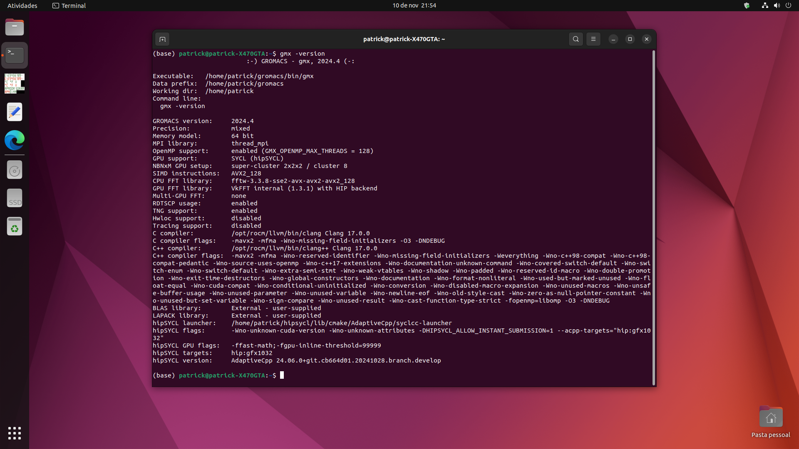

# Compilando Gromacs 2024.x com ROCm e AdaptiveCpp/SyCL no Ubuntu 22.04




> Tutorial para compilar o Gromacs 2024.x com AdaptiveCpp 24.06 em backend com ROCm 5.7.1 no Ubuntu 22.04, para utilizar aceleração GPU RDNA2 em máquinas pequenas.

## 💻 Computador testado e Pré-requisitos:
- CPU Ryzen 7 2700X, Memória 2x16 GB DDR4, Chipset X470, GPU ASRock RX 6600 CLD 8 GB, dual boot com Windows 11 e Ubuntu 22.04 instalados em SSD's separados.

Antes de começar, verifique se você atendeu aos seguintes requisitos:

- Você tem uma máquina `Linux Ubuntu 22.04` atualizado.
- Você tem uma GPU série `AMD RX 6xxx RDNA2`. Não testado com outras arquiteturas.
- Documentações [ROCm 5.7.1](https://rocm.docs.amd.com/en/docs-5.7.1/), [AdaptiveCpp 24.06](https://github.com/AdaptiveCpp/AdaptiveCpp).

Você também vai precisar atualizar e instalar pacotes em sua máquina:

```
sudo apt update && sudo apt upgrade -y
```
```
sudo apt install cmake libboost-all-dev git build-essential libstdc++-12-dev libc++-16-dev libhwloc-dev hwloc grace
```
```
sudo apt autoremove && sudo apt autoclean
```

## 🔧 Instalando Kernel 5.15 generic

Para instalar o `Kernel 5.15 generic` no Ubuntu 22.04, siga estas etapas:

```
sudo apt install linux-image-generic
```

Adicione os headers e módulos extras do Kernel:

```
sudo apt install "linux-headers-$(uname -r)" "linux-modules-extra-$(uname -r)"
```

Em seguida e *nessa ordem*, altere para usar o Kernel 5.15 e remova os demais Kernels instalados. Essa tarefa pode ser feita com o [GRUB CUSTOMIZER](https://www.edivaldobrito.com.br/grub-customizer-no-ubuntu/) ou no terminal. Existe vasto material na internet para auxiliar nessa tarefa, aqui coloco apenas o objetivo principal que é instalar e usar o Kernel 5.15 na máquina.

>[!NOTE]
>
>**Meu Caso**: Realizei um reboot e utilizei o GRUB para alterar o Kernel. Depois `sudo dpkg -l | grep linux-image` para listar os Kernels, `sudo apt remove` e `sudo apt autoremove && sudo apt autoclean` remover os Kernels instalados.

>[!TIP]
>
>O comando abaixo ajudará a identificar o Kernel instalado:
>
>```
>uname -r
>```

## 🪛 Instalando ROCm 5.7.1

Vamos instalar o `ROCm 5.7.1`. Precisamos dar previlégios ao usuário e adicioná-lo a grupos:

```
sudo usermod -a -G render,video $LOGNAME
```
```
echo ‘ADD_EXTRA_GROUPS=1’ | sudo tee -a /etc/adduser.conf
```
```
echo ‘EXTRA_GROUPS=video’ | sudo tee -a /etc/adduser.conf
```
```
echo ‘EXTRA_GROUPS=render’ | sudo tee -a /etc/adduser.conf
```

Download e instalação do pacote `ROCm 5.7.1`:

```
https://repo.radeon.com/amdgpu-install/5.7.1/ubuntu/jammy/amdgpu-install_5.7.50701-1_all.deb
```
```
sudo apt install ./amdgpu-install_5.7.50701-1_all.deb
```

Utilizando o `amdgpu-install`, instalar o pacote `rocm,hip,hiplibsdk`:

```
sudo amdgpu-install --usecase=rocm,hip,hiplibsdk
```

Atualizar todos os índices e links de bibliotecas:

```
sudo ldconfig
```

Para verificar a instalação, utilize:

```
sudo clinfo
```
```
sudo rocminfo
```

A GPU deverá ser identificada. Caso não consiga, experimente `reboot` e verifique novamente. Instalação ficará em `PATH=/opt/rocm`.

>[!TIP]
>
>Utilize o comando abaixo para listar todos os `cases` disponíveis no `amdgpu-install`:
>
>```
>sudo amdgpu-install --list-usecase
>```
>
>Para remover `amdgpu-install`, utilize:
>
>```
>amdgpu-uninstall
>```
>```
>sudo apt purge amdgpu-install
>```
>

## 🔨 Instalação LLVM e bibliotecas

O `AdaptiveCpp` requer LLVM/Clang e algumas bibliotecas. Para instalar, faça:

```
wget https://apt.llvm.org/llvm.sh
```
```
sudo chmod +x llvm.sh
```
```
sudo ./llvm.sh 16
```
```
sudo apt install -y libclang-16-dev clang-tools-16 libomp-16-dev llvm-16-dev lld-16
```

## 🪚 Instalação do AdaptiveCpp 24.06

O `AdaptiveCpp 24.06` irá trabalhar em backend com `ROCm 5.7.1`. Ele contém o `SyCL`. Para instalar:

```
git clone https://github.com/AdaptiveCpp/AdaptiveCpp
```
```
cd AdaptiveCpp
```
```
sudo mkdir build && cd build
```

Para compilar com CMake:

```
sudo cmake .. -DCMAKE_INSTALL_PREFIX=/home/patrick/sycl -DCMAKE_C_COMPILER=/opt/rocm/llvm/bin/clang -DCMAKE_CXX_COMPILER=/opt/rocm/llvm/bin/clang++ -DLLVM_DIR=/opt/rocm/llvm/lib/cmake/llvm/ -DROCM_PATH=/opt/rocm -DWITH_ROCM_BACKEND=ON -DWITH_SSCP_COMPILER=OFF -DWITH_OPENCL_BACKEND=OFF -DWITH_LEVEL_ZERO_BACKEND=OFF -DDEFAULT_TARGETS='hip:gfx1032'
```
```
sudo make install -j 16
```

>[!NOTE]
>
>**Meu Caso**: Recomendo criar pastas para as compilações, assim se algo der errado é só apagar e recomeçar. Criei a pasta `sycl` com `sudo mkdir sycl` e indiquei com `-DCMAKE_INSTALL_PREFIX` ao compilar. Em `-DDEFAULT_TARGETS` completar `ABC` em `hip:gfx1ABC` com a informação obtida em `clinfo` ou `rocminfo`. Esse código corresponde ao endereçamento físico da GPU. No `sudo make install -j 16`, a tag `-j 16` define a quantidade de CPUs (16) utilizadas na compilação.

>[!WARNING]
>
>Sempre fique atento aos caminhos de endereçamentos, *i.e* `/path/to/user/...`, porque são os maiores causadores de erros durante as compilações.


## 💎 Instalação do Gromacs 2024.x

**OPCIONAL!** Antes de instalar o Gromacs, você talvez queira instalar algumas bibliotecas que melhora o desempenho e eficiência de cálculos no Gromacs. *Essas bibliotecas são opcionais porque o Gromacs já tem BLAS e LAPACK built-in*. No caso abaixo, irá instalar as bibliotecas `BLAS LAPACK 64bit` em `/usr/lib/x86_64-linux-gnu/blas64/libblas64.so` e `/usr/lib/x86_64-linux-gnu/lapack64/liblapack64.so`.

```
sudo apt install liblapack64-dev libblas64-dev
```

**ROCBLAS E ROCSOLVER!** São bibliotecas otimizadas para hardwares AMD. São opcionais e também tem `HIPBLAS HIPSOLVER`. São instaladas com o `amdgpu-install`.

A partir de agora, você poderá seguir a documentação [guia de instalação](https://manual.gromacs.org/current/install-guide/index.html) do Gromacs. No momento de compilar com CMake, utilize:

```
sudo cmake .. -DGMX_BUILD_OWN_FFTW=ON -DREGRESSIONTEST_DOWNLOAD=ON -DGMX_HWLOC=ON -DCMAKE_C_COMPILER=/opt/rocm/llvm/bin/clang -DCMAKE_CXX_COMPILER=/opt/rocm/llvm/bin/clang++ -DHIPSYCL_TARGETS='hip:gfx1032' -DGMX_GPU=SYCL -DGMX_SYCL=ACPP -DCMAKE_INSTALL_PREFIX=/home/patrick/gromacs -DCMAKE_PREFIX_PATH=/home/patrick/sycl -DSYCL_CXX_FLAGS_EXTRA=-DHIPSYCL_ALLOW_INSTANT_SUBMISSION=1 -DGMX_EXTERNAL_BLAS=on -DGMX_EXTERNAL_LAPACK=on -DGMX_BLAS_USER=/opt/rocm/rocblas/lib/librocblas.so -DGMX_LAPACK_USER=/opt/rocm/rocsolver/lib/librocsolver.so
```
Novamente, criei uma pasta chamada `gromacs` para os arquivos compilados e indiquei com `-DCMAKE_INSTALL_PREFIX`. 

>[!NOTE]
>
>**Meu Caso**: Utilizei as bibliotecas `ROCBLAS` e `ROCSOLVER` para os cálculos, indicando com `-DGMX_EXTERNAL_BLAS=ON -DGMX_EXTERNAL_LAPACK=ON -DGMX_BLAS_USER= -DGMX_LAPACK_USER=`. Se não for o seu caso, apagar essas tags. Também utilizei suporte RAy Atenção ao `-DHIPSYCL_TARGETS='hip:gfxABC'`, substitua com os seus valores.

Agora é o momento de compilar, checar e instalar:

```
sudo make -j 16 && sudo make check -j 16
```
```
sudo make install -j 16
```

Para carregar a biblioteca e invocar o Gromacs:

```
source /home/patrick/gromacs/bin/GMXRC
```
```
gmx -version
```

>[!WARNING]
>
>Durante `sudo make check -j 16` ocorreram erros por TIMEOUT. Prossegui e testei uma dinâmica simples e não houve nenhum problema. Aparentemente, mais usuários do Gromacs 2024 enfrentam esses problemas e com `-DGMX_TEST_TIMEOUT_FACTOR=2` pode dar mais tempo para o teste.

>[!TIP]
>
>Você poderá editar o arquivo `/home/patrick/.bashrc` e adicionar o código `source /home/patrick/gromacs/bin/GMXRC`. Assim, toda vez que abrir o terminal já irá carregar o Gromacs.

🧪🧬⚗️ *Boas dinâmicas moleculares!*

## 📜 Citação

- FAUSTINO, P. A. S. Tutorials: Compilando Gromacs 2024.x com ROCm e AdaptiveCpp/SyCL no Ubuntu 22.04, 2024. README. Disponível em: <https://github.com/patrickallanfaustino/tutorials/blob/main/rocm-adaptivecpp-gromacs.md>. Acesso em: [dia] de [mês] de [ano].


## 📝 Licença

Esse projeto está sob licença. Veja o arquivo [LICENÇA](LICENSE.md) para mais detalhes.
